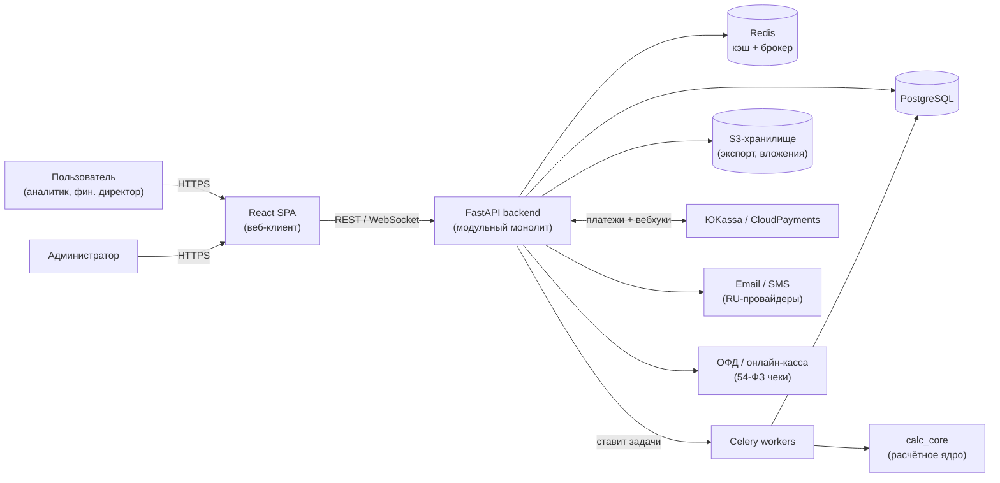
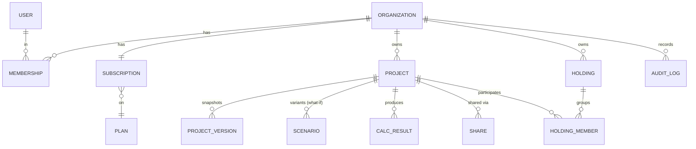
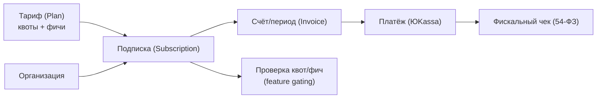

# Архитектура SaaS (финансовое моделирование, паритет с Project Expert)

> **Назначение документа.** Детальный архитектурный проект нашего SaaS-продукта,
> функционально эквивалентного Project Expert 7.21, но с современным web-интерфейсом,
> подписочной моделью оплаты и возможностью расширения. Основан на исследовании
> [`RESEARCH-ProjectExpert.md`](./RESEARCH-ProjectExpert.md).
>
> **Статус:** Этап 2 — проектирование архитектуры. Код не пишется; это «карта»,
> по которой пойдёт реализация (этап 3+).
>
> **Дата:** 2026-06-20

## Зафиксированные вводные (решения этапа 2)

| Параметр | Решение | Следствия |
|---|---|---|
| **Рынок** | Россия и СНГ | Биллинг ЮKassa/CloudPayments, рубли, **152-ФЗ** (хранение ПДн в РФ), **54-ФЗ** (фискальные чеки), русский UI в приоритете |
| **Стек** | Python-бэкенд + React | FastAPI + SQLAlchemy + Celery; расчётное ядро — изолированный Python-пакет с точной decimal-арифметикой; фронтенд React + TypeScript |
| **Объём** | Полный паритет сразу | Модель данных и расчётное ядро проектируются под весь функционал (включая холдинг, what-if, Монте-Карло, актуализацию, язык формул) с самого начала |

---

## Содержание

1. [Цели, принципы и нефункциональные требования](#1-цели-принципы-и-нефункциональные-требования)
2. [Обзор системы (контекст и контейнеры)](#2-обзор-системы-контекст-и-контейнеры)
3. [Технологический стек](#3-технологический-стек)
4. [Мультиарендность (multi-tenancy)](#4-мультиарендность-multi-tenancy)
5. [Доменная модель данных (замена `.pex`)](#5-доменная-модель-данных-замена-pex)
6. [Расчётное ядро как сервис](#6-расчётное-ядро-как-сервис)
7. [Язык формул](#7-язык-формул)
8. [API](#8-api)
9. [Фоновые задачи и тяжёлые расчёты](#9-фоновые-задачи-и-тяжёлые-расчёты)
10. [Фронтенд и дизайн-система](#10-фронтенд-и-дизайн-система)
11. [Аутентификация, авторизация, роли](#11-аутентификация-авторизация-роли)
12. [Биллинг и подписка (РФ)](#12-биллинг-и-подписка-рф)
13. [Отчёты, экспорт, интеграции](#13-отчёты-экспорт-интеграции)
14. [Инфраструктура и развёртывание](#14-инфраструктура-и-развёртывание)
15. [Безопасность и соответствие (152-ФЗ / 54-ФЗ)](#15-безопасность-и-соответствие-152-фз--54-фз)
16. [Наблюдаемость и эксплуатация](#16-наблюдаемость-и-эксплуатация)
17. [Производительность и масштабирование](#17-производительность-и-масштабирование)
18. [Миграция данных (импорт `.pex`)](#18-миграция-данных-импорт-pex)
19. [Дорожная карта (последовательность сборки)](#19-дорожная-карта-последовательность-сборки)
20. [Риски и открытые вопросы](#20-риски-и-открытые-вопросы)
21. [Глоссарий](#21-глоссарий)

---

## 1. Цели, принципы и нефункциональные требования

### Цели
- **Функциональный паритет** с Project Expert 7.21 (см. research-документ, раздел 4).
- **Корректность расчётов** — цифры воспроизводимы и детерминированы; методика
  версионируется.
- **Расширяемость** — добавление новых разделов/показателей без ломающих изменений.
- **SaaS-модель** — мультиарендность, подписка, командная работа, веб-доступ.

### Архитектурные принципы
1. **Расчётное ядро отделено от приложения.** `calc_core` — чистая функция
   `модель → результаты`, без зависимостей от БД, HTTP, тенантов. Это упрощает
   тестирование «золотым эталоном» (golden master) и переиспользование.
2. **Детерминизм и точность.** Денежные величины — `Decimal` с явным контекстом
   округления. Каждый результат помечается версией ядра (`engine_version`).
3. **Модульный монолит, готовый к выделению сервисов.** Стартуем как один развёртываемый
   бэкенд с чёткими модулями-границами (домены). Тяжёлые расчёты — отдельные воркеры.
   Выделение в микросервисы — только при доказанной необходимости.
4. **Данные принадлежат арендатору.** Изоляция по `organization_id` + Row-Level Security.
5. **API-first.** Бэкенд — REST API с OpenAPI; фронтенд и будущие интеграции — клиенты.
6. **Эволюционируемость схемы.** Стабильное реляционное ядро + гибкие JSONB-поддеревья
   для модели проекта.

### Нефункциональные требования (черновые цели)
| Категория | Требование |
|---|---|
| Производительность | Базовый пересчёт проекта среднего размера < 1–2 с (синхронно); Монте-Карло (10k итераций) — фоном, прогресс в реальном времени |
| Масштабирование | Горизонтальное для API и воркеров; БД — вертикально + реплики на чтение |
| Доступность | Цель 99.9%; БД с бэкапами и PITR |
| Безопасность | Шифрование в транзите и покое, RBAC, аудит, RLS |
| Соответствие | 152-ФЗ (резидентность данных в РФ), 54-ФЗ (чеки) |
| Локализация | RU (основной), архитектурно готово к мультиязычию |
| Точность | Денежная арифметика без потери точности (Decimal/scaled int) |

---

## 2. Обзор системы (контекст и контейнеры)

### Контекстная диаграмма



### Контейнеры (логические компоненты)

| Контейнер | Технология | Ответственность |
|---|---|---|
| **Web SPA** | React + TS + Vite | UI: редакторы разделов, таблицы, графики, Гантт, отчёты |
| **API (монолит)** | FastAPI | REST/WS, аутентификация, авторизация, оркестрация расчётов, биллинг |
| **calc_core** | Python-пакет | Детерминированный расчёт модели → отчёты и показатели |
| **Worker** | Celery | Тяжёлые расчёты (Монте-Карло, актуализация холдинга), экспорт, импорт `.pex` |
| **PostgreSQL** | Managed Postgres | Хранение тенантов, проектов, версий, результатов, биллинга |
| **Redis** | Managed Redis | Кэш, брокер очередей, rate-limit, pub/sub прогресса задач |
| **Object Storage** | S3-совместимое (Yandex/VK) | Файлы экспорта, вложения, импортируемые `.pex` |

> **Почему модульный монолит, а не микросервисы сразу.** При полном паритете доменов
> много, но они тесно связаны общей моделью проекта; распил на сервисы на старте добавит
> сетевые границы и распределённые транзакции без выгоды. Границы модулей внутри монолита
> позволяют выделить сервис позже (наиболее вероятный кандидат — `calc_core` за отдельным
> RPC, что уже заложено через очередь задач).

---

## 3. Технологический стек

### Бэкенд
- **FastAPI** — async, генерация OpenAPI, валидация через **Pydantic v2**.
  - *Альтернатива:* Django (встроенные admin/ORM/auth). Выбран FastAPI из-за API-first
    и тесной интеграции Pydantic с моделью расчётного ядра. Админку при необходимости
    добавим отдельно (SQLAdmin / собственная).
- **SQLAlchemy 2.0** (ORM, async) + **Alembic** (миграции).
- **Celery** (+ Redis как брокер; результаты в Postgres) — фоновые задачи.
- **NumPy** — векторные вычисления и Монте-Карло; **Decimal** — каноническая денежная
  арифметика (см. раздел 6).
- **Pandas** — импорт/экспорт табличных данных (Excel), вспомогательные преобразования.
- Тестирование: **pytest**, golden-master регрессии для `calc_core`.

### Фронтенд
- **React + TypeScript + Vite**.
- **TanStack Query** — серверное состояние; **Zustand** — локальный UI-стейт.
- **AG Grid** — основные редактируемые финансовые таблицы (плотные сетки, ключ UX).
- **ECharts** (или Recharts) — графики/диаграммы.
- **Библиотека Гантта** (dhtmlx-gantt / svar-gantt / frappe-gantt) — календарный план.
- **Компонентная база:** Mantine или Ant Design (плотные данные, формы, i18n).
- **i18n:** react-i18next (RU по умолчанию).

### Данные и инфраструктура
- **PostgreSQL** (JSONB для поддеревьев модели), **Redis**, **S3-совместимое хранилище**.
- **Docker**, CI/CD (GitLab CI или GitHub Actions), IaC (**Terraform**).
- Хостинг в РФ (Yandex Cloud / VK Cloud / Selectel) — см. раздел 15.

---

## 4. Мультиарендность (multi-tenancy)

**Модель: одна БД, одна схема, изоляция по `organization_id` + Postgres Row-Level
Security (RLS).**

- Каждая таблица с данными арендатора содержит `organization_id`.
- RLS-политики гарантируют, что запрос видит только строки своего тенанта (защита в
  глубину поверх логики приложения). `organization_id` текущего запроса задаётся через
  сессионную переменную Postgres (`SET app.current_org`).
- **Почему так:** простейшая эксплуатация и масштабирование для массового SaaS, один
  пул миграций, дешёвое онбординг новых тенантов.

| Альтернатива | Когда оправдана | Почему не сейчас |
|---|---|---|
| Схема на тенанта | Десятки крупных enterprise-клиентов | Сложные миграции, тяжёлый онбординг |
| БД на тенанта | Жёсткие требования изоляции/локализации | Высокая стоимость эксплуатации |

> Путь миграции к более строгой изоляции (выделение крупного клиента в отдельную БД)
> остаётся открытым благодаря тому, что весь доступ идёт через `organization_id`.

---

## 5. Доменная модель данных (замена `.pex`)

Заменяем единый бинарный файл `.pex` на структурированную модель в Postgres.

### 5.1. Стратегия хранения: «реляционное ядро + JSONB-поддеревья»

- **Реляционно** (отдельные таблицы, внешние ключи, индексы): тенантность, проекты,
  версии, сценарии, результаты расчёта, биллинг, аудит, шаринг. То, по чему нужны
  запросы, права и связи.
- **JSONB-поддокументы**: содержимое разделов модели проекта (план сбыта, налоги,
  стартовый баланс, формулы и т.п.) — много вложенности и временных рядов, которые
  редактируются «как единое целое» и не требуют межпроектных запросов по отдельным
  ячейкам.
- **Временные ряды** (помесячные векторы) хранятся как массивы в JSONB (значения —
  строки Decimal, чтобы не терять точность). Каноничная единица времени — **месяц от
  даты старта проекта** (индекс 0..N-1).

> Такой гибрид даёт гибкость документной модели (быстро эволюционировать состав
> разделов под полный паритет) и надёжность реляционной части (права, биллинг,
> результаты).

### 5.2. Верхнеуровневые сущности (реляционные)



| Сущность | Назначение |
|---|---|
| `organization` | Арендатор (компания-клиент) |
| `user` / `membership` | Пользователи и их роли в организации |
| `subscription` / `plan` | Подписка и тариф (квоты/фичи) |
| `project` | Метаданные проекта (имя, валюты, старт, горизонт, владелец) |
| `project_version` | Неизменяемые снимки модели (история, откат, «релизы» проекта) |
| `scenario` | Варианты проекта для what-if (ветки от базового) |
| `calc_result` | Результаты расчёта (хэш входа + `engine_version` + отчёты) |
| `share` | Доступ к проекту по ссылке/пользователю с правами |
| `holding` / `holding_member` | Холдинг и входящие в него проекты (PIC Holding / Integrator) |
| `audit_log` | Журнал действий (безопасность, 152-ФЗ) |

### 5.3. Модель проекта (JSONB-поддокумент `project_version.model`)

Состав соответствует разделам Project Expert (research §4). Каждый блок — поддокумент
с типобезопасной Pydantic-схемой:

```
ProjectModel
├── header            # название, даты, длительность (мес.), список продуктов, описание
├── settings          # ставки дисконтирования по валютам, шаг дисконта, детализация
├── company
│   ├── starting_balance   # ~20 статей (капитал, ОС, запасы, дебиторка/кредиторка, ...)
│   ├── bank_accounting    # принципы учёта, периодичность
│   ├── structure          # подразделения
│   └── cost_allocation    # разнесение издержек
├── environment
│   ├── currencies         # основная/вторая, курс (временной ряд)
│   ├── refinancing_rate    # учётная ставка ЦБ (ряд)
│   ├── inflation          # группы: сбыт, издержки, недвижимость, зарплата, ОС (ряды)
│   └── taxes[]            # настраиваемые налоги: база, ставка, период, формула
├── investment_plan
│   ├── stages[]          # календарный план: иерархия, связи, даты, тип, статус
│   ├── assets[]          # активы: амортизация, доинвестиции, переоценка, продажа
│   └── resources[]       # ресурсы и графики выплат
├── operating_plan
│   ├── sales[]           # план сбыта: объём(ряд), цены, скачки, условия оплаты/поставок
│   ├── production[]      # план производства: продукты, материалы(BOM), сдельная ЗП
│   ├── materials[]       # сырьё и комплектующие: закупки, цены
│   ├── staff[]           # план персонала
│   └── general_costs[]   # общие издержки (накладные)
├── financing
│   ├── equity[]          # акционерный капитал (выпуски)
│   ├── loans[]           # займы: график, проценты, автоподбор
│   ├── leasing[]         # лизинг: платежи, выкуп, страхование
│   ├── investments[]     # вложения (депозиты/ЦБ)
│   ├── other_in[] / other_out[]   # прочие поступления/выплаты
│   ├── profit_distribution        # дивиденды
│   └── tax_benefits[]    # льготы по налогу на прибыль
├── user_tables[]         # произвольные таблицы на языке формул (см. §7)
├── analysis
│   ├── sensitivity[]     # конфигурации анализа чувствительности
│   ├── monte_carlo       # неопределённые параметры + распределения
│   ├── break_even        # настройки безубыточности
│   ├── valuation         # оценка бизнеса: 5 методов + DDM/мультипликаторы
│   └── participants[]    # доходы участников/подразделений
└── actualization         # план-факт: фактические данные по периодам
```

> Результаты (P&L, Кэш-фло, Баланс, фин. показатели, эффективность инвестиций) **не
> хранятся в модели** — это выход `calc_core`, кэшируется в `calc_result`.

### 5.4. Версионирование, сценарии, автосохранение

- **Рабочая копия (draft):** текущее редактируемое состояние модели проекта.
- **Версии (`project_version`):** неизменяемые снимки по запросу/расписанию (история,
  сравнение, откат). Хранят `model` + метку времени + автора.
- **Сценарии (`scenario`):** именованные ветки модели для what-if-анализа (наследуют
  базу, переопределяют параметры). Сравнение сценариев — на уровне результатов.
- **Автосохранение:** периодическое сохранение draft; конфликты при совместном
  редактировании разрешаются оптимистичной блокировкой (версия документа) — реалтайм-
  co-editing (CRDT) на старте не требуется, закладывается на будущее.

---

## 6. Расчётное ядро как сервис

`calc_core` — **отдельный Python-пакет**, не знающий о БД/HTTP/тенантах.

### 6.1. Контракт
```
calc_core.run(model: ProjectModel, options: CalcOptions) -> CalcResult
```
- **Чистая, детерминированная функция:** одинаковый вход → одинаковый выход.
- Вход — Pydantic-модель проекта; выход — структуры отчётов и показателей.
- Никаких побочных эффектов, случайности (кроме Монте-Карло — со seed).

### 6.2. Точность денежной арифметики
- **Канонические отчёты** (P&L, Кэш-фло, Баланс, показатели): тип **`Decimal`** с
  явным контекстом (например `ROUND_HALF_UP`, заданная точность/масштаб по валюте).
  Никаких float в финансовых суммах.
- **Монте-Карло** (тысячи итераций × месячные векторы): для скорости — **NumPy float64**
  на стадии сэмплирования, с округлением агрегатов; точность здесь статистическая, что
  допустимо. Базовый детерминированный прогон при этом остаётся на Decimal.
- Сериализация результатов — Decimal как строки в JSONB (без двоичного дрейфа).

### 6.3. Конвейер расчёта (помесячно)
1. Построение временной оси (месяцы от старта до горизонта).
2. Развёртывание входов в месячные ряды (объёмы, цены, инфляция, курсы, ставки).
3. **Операционный контур:** сбыт → производство → потребность в материалах →
   прямые/общие издержки → зарплата → налоги.
4. **Инвестиционный контур:** этапы, активы, амортизация, переоценки.
5. **Финансовый контур:** займы/лизинг/капитал/инвестиции/дивиденды; **автоподбор**
   кредитов/инвестиций под дефицит наличности (итеративно).
6. **Сведение отчётности:** Кэш-фло → Баланс → Отчёт о прибылях и убытках (с проверкой
   балансовых тождеств).
7. **Показатели:** дисконтирование потоков → PB/DPB/ARR/NPV/PI/IRR/MIRR; финансовые
   коэффициенты (5 групп); пользовательские таблицы (язык формул).
8. **Анализ (по запросу):** чувствительность, безубыточность, оценка бизнеса.

### 6.4. Версионирование методики и тесты
- `engine_version` (semver) сохраняется в каждом `calc_result`. Изменение методики =>
  новая версия => прозрачная воспроизводимость старых расчётов.
- **Golden master:** набор эталонных проектов с зафиксированными ожидаемыми числами;
  любые расхождения ловятся регрессией (аналог утилиты `clctst32.exe` в оригинале).
- **Кэширование:** ключ результата = `hash(model_canonical) + engine_version + options`.
  Повторный расчёт без изменений берётся из `calc_result`/Redis.

---

## 7. Язык формул

Воспроизводим встроенный язык формул Project Expert (research §5) — ~40 функций над
месячными векторами (Дисконтировать, Аккумулировать, Тенденция, Если, IRR/IRRV, Сдвиг,
Объединить в период, мат. функции и т.д.).

**Реализация — собственный безопасный мини-язык (НЕ `eval`):**
- **Лексер → парсер → AST → интерпретатор** над векторами NumPy/Decimal.
- Только разрешённые функции и переменные (ссылки на строки отчётов/таблиц); песочница,
  лимиты на время/размер.
- Переменные — именованные ряды (строки отчётов, статьи, пользовательские таблицы).
- Используется в: пользовательских таблицах, формулах налогов, произвольных показателях.

> Это отдельная, тщательно протестированная подсистема (критична для гибкости и для
> совпадения результатов с оригиналом).

---

## 8. API

- **Стиль:** REST, ресурсно-ориентированный, версионирование префиксом (`/api/v1`).
- **Документация:** автогенерация OpenAPI (FastAPI), Swagger UI.
- **Аутентификация:** JWT (access + refresh) либо httpOnly-сессии; все запросы
  ограничены организацией пользователя.
- **Реальное время:** WebSocket/SSE для прогресса фоновых задач (Монте-Карло, экспорт).

Примеры маршрутов:
```
POST   /api/v1/auth/login | refresh | logout
GET    /api/v1/orgs/{org}/projects
POST   /api/v1/orgs/{org}/projects
GET    /api/v1/projects/{id}                 # метаданные + draft-модель
PATCH  /api/v1/projects/{id}/model/sales     # частичное обновление раздела
POST   /api/v1/projects/{id}/versions        # зафиксировать снимок
GET    /api/v1/projects/{id}/results         # последние результаты (кэш)
POST   /api/v1/projects/{id}/calculate       # пересчёт (sync для лёгких)
POST   /api/v1/projects/{id}/monte-carlo     # запуск фоновой задачи -> job_id
GET    /api/v1/jobs/{job_id}                 # статус/прогресс/результат
POST   /api/v1/projects/{id}/export          # PDF/XLSX/DOCX -> файл в S3
GET    /api/v1/holdings/{id}/budget          # сводный бюджет холдинга
POST   /api/v1/billing/webhook/yookassa      # вебхук платежей
```

---

## 9. Фоновые задачи и тяжёлые расчёты

**Celery-воркеры** (брокер Redis, результаты в Postgres) обрабатывают:
- **Монте-Карло** — N итераций (распараллеливание по чанкам), агрегирование статистики,
  прогресс через pub/sub → WebSocket.
- **Актуализация и сводка холдинга** — пересчёт связанных проектов.
- **Экспорт** — генерация PDF/XLSX/DOCX, выгрузка в S3, ссылка пользователю.
- **Импорт `.pex`** (см. §18).

Свойства: идемпотентность задач, ретраи с backoff, ограничение конкуренции на тенанта
(чтобы один клиент не занял всех воркеров), отдельные очереди по типам (быстрые/тяжёлые).

---

## 10. Фронтенд и дизайн-система

### Структура
- Модули UI повторяют разделы модели (Проект, Компания, Окружение, Инвестиционный план,
  Операционный план, Финансирование, Результаты, Анализ, Актуализация).
- **Server state** — TanStack Query (кэш, инвалидация после пересчёта); **UI state** —
  Zustand.

### Ключевые UI-компоненты
| Компонент | Решение | Зачем |
|---|---|---|
| Финансовые таблицы | **AG Grid** | Плотные редактируемые сетки помесячных данных — ядро UX |
| Графики/диаграммы | **ECharts** | Богатые финансовые визуализации, локализация |
| Диаграмма Гантта | спец-библиотека | Календарный план инвестиций (этапы, связи) |
| Формы разделов | Mantine/AntD + react-hook-form | Плотные формы, валидация |
| Дерево бизнес-плана | tree-компонент | Текстовое описание (структура бизнес-плана) |

### Дизайн и доступность
- Современная дизайн-система: единые токены (цвет/типографика/отступы), **светлая и
  тёмная темы**, адаптивность, доступность (WCAG AA).
- Локализация RU по умолчанию (react-i18next), числовые/денежные форматы по локали.

---

## 11. Аутентификация, авторизация, роли

- **Аутентификация:** email + пароль (Argon2-хэш), подтверждение почты, сброс пароля,
  2FA (TOTP) опционально. SSO/OAuth — на будущее.
- **Модель ролей (RBAC, в пределах организации):**

| Роль | Права |
|---|---|
| Owner | Полный доступ + биллинг + удаление организации |
| Admin | Управление участниками и проектами, без биллинга-владельца |
| Editor | Создание/редактирование проектов |
| Analyst | Расчёты, анализ, экспорт; ограниченное редактирование |
| Viewer | Только просмотр и экспорт |

- **Уровень проекта:** дополнительный шаринг (конкретным пользователям или по ссылке)
  с правами view/edit поверх ролей организации.
- Все проверки прав — централизованно (зависимости FastAPI) + RLS как защита в глубину.

---

## 12. Биллинг и подписка (РФ)

### Провайдеры
- **Основной:** **ЮKassa** (рекуррентные платежи через сохранённый способ оплаты;
  встроенная фискализация 54-ФЗ — формирование чеков).
- **Альтернатива/резерв:** CloudPayments. Абстрагируем платёжный слой интерфейсом
  `PaymentProvider`, чтобы провайдер был сменяемым.

### Модель


- **Тарифы (Plan):** уровни с квотами — число проектов, размер команды, лимит итераций
  Монте-Карло, доступ к холдингу/what-if, объём экспорта, хранение версий.
- **Подписка (Subscription):** статус (trial/active/past_due/canceled), период, привязка
  к организации.
- **Рекуррентные платежи:** сохранённый способ оплаты + плановое списание; обработка
  неуспеха (retry, грейс-период, даунгрейд).
- **Вебхуки** ЮKassa → обновление статуса подписки (идемпотентно, с проверкой подписи).
- **Фискализация (54-ФЗ):** чек на каждый платёж через ЮKassa/ОФД.
- **Feature gating:** единый сервис проверки квот/доступности фич по подписке.
- **Триал:** пробный период без оплаты, мягкие лимиты.

---

## 13. Отчёты, экспорт, интеграции

| Возможность | Реализация |
|---|---|
| Экспорт в **PDF** | Серверный рендер шаблонов (WeasyPrint/Playwright) |
| Экспорт в **Excel (XLSX)** | openpyxl/pandas — таблицы и показатели |
| Экспорт в **Word (DOCX)** | python-docx — бизнес-план по шаблонам (аналог `*.DOT`) |
| Импорт данных | XLSX (план сбыта, объёмы и т.п.) |
| **HTML/публичная ссылка** | Просмотр отчёта по защищённой ссылке |
| **REST API** | Программный доступ (замена DDE-сервера оригинала) |
| Вебхуки наружу | Уведомления о завершении расчётов/изменениях |

Генерация тяжёлых документов — фоном (Celery), результат в S3 + ссылка.

---

## 14. Инфраструктура и развёртывание

- **Хостинг в РФ** (152-ФЗ): Yandex Cloud / VK Cloud / Selectel.
- **Контейнеризация:** Docker-образы (API, worker, frontend-статика за CDN/nginx).
- **Оркестрация:** старт — управляемая платформа/Docker Compose; рост — managed
  Kubernetes.
- **Хранилища:** managed PostgreSQL (бэкапы + PITR), managed Redis, S3-совместимое
  объектное хранилище.
- **CI/CD:** сборка, тесты (вкл. golden-master `calc_core`), миграции Alembic, деплой
  по окружениям (dev/staging/prod).
- **IaC:** Terraform (воспроизводимая инфраструктура).
- **Окружения:** dev → staging → prod; секреты — в менеджере секретов, не в репозитории.

---

## 15. Безопасность и соответствие (152-ФЗ / 54-ФЗ)

### 152-ФЗ (персональные данные)
- **Резидентность данных:** БД и бэкапы с ПДн граждан РФ — на серверах в РФ.
- Регистрация оператора ПДн (Роскомнадзор), политика конфиденциальности, **согласие на
  обработку ПДн** при регистрации.
- Минимизация ПДн, разграничение доступа, журналирование (`audit_log`).

### 54-ФЗ (расчёты)
- Фискальные чеки на платежи (через ЮKassa/ОФД).

### Общая безопасность
- TLS везде; шифрование БД/хранилища в покое.
- Хэширование паролей (Argon2), защита от перебора (rate-limit, блокировки).
- **RLS** в Postgres + проверки прав в приложении.
- Защита от OWASP Top-10; CSRF/XSS-меры; CSP.
- Управление секретами, регулярные бэкапы и проверка восстановления.
- Аудит действий пользователей и администраторов.

---

## 16. Наблюдаемость и эксплуатация

- **Логи:** структурированные (JSON), корреляция по request_id/tenant.
- **Метрики:** Prometheus + Grafana (латентность API, длина очередей, время расчётов).
- **Ошибки:** Sentry/GlitchTip.
- **Трейсинг:** OpenTelemetry (сквозной путь запрос → расчёт → задача).
- **Алёрты:** на ошибки платежей, отказы воркеров, рост времени расчёта, заполнение БД.
- **Здоровье:** health/readiness-probes, бюджеты ошибок.

---

## 17. Производительность и масштабирование

- **API** — stateless, горизонтальное масштабирование за балансировщиком.
- **Воркеры** — масштабируются отдельно; тяжёлые очереди изолированы от лёгких.
- **Кэш результатов** — по хэшу входа и версии ядра (Redis + `calc_result`).
- **БД** — индексация, пагинация, реплики на чтение; «тяжёлые» JSONB-поддеревья
  читаются по необходимости.
- **Монте-Карло** — распараллеливание по чанкам итераций; векторизация NumPy.
- **Лимиты на тенанта** — честное распределение ресурсов (rate-limit, квоты воркеров).

---

## 18. Миграция данных (импорт `.pex`)

- Цель: импорт существующих проектов клиентов из бинарного `.pex` (`PEW File v7`).
- Подход: отдельный **парсер-ридер** формата (реверс-инжиниринг структуры) → маппинг в
  нашу `ProjectModel`. Запускается как фоновая задача, с отчётом о неподдержанных
  элементах.
- **Приоритет:** не на старте (R&D-задача); закладываем расширяемость, реализуем как
  отдельную фазу. Важно как канал миграции пользователей с оригинала.

---

## 19. Дорожная карта (последовательность сборки)

Цель — **полный паритет**. Даже при этой цели сборка идёт фазами (нельзя выпустить всё
одним коммитом); порядок выбран так, чтобы каждая фаза давала работающий вертикальный
срез.

| Фаза | Содержание | Результат |
|---|---|---|
| **0. Фундамент** | Тенантность, auth/RBAC, биллинг-каркас, CRUD проектов, схема БД, CI/CD, инфра в РФ | Можно регистрироваться, создавать проекты, платить |
| **1. Ядро + 3 отчёта** | Модель: проект, окружение, операционный план, инвестиционный план, финансирование; `calc_core` → P&L/Кэш-фло/Баланс + NPV/IRR + коэффициенты | Базовая модель считается, цифры сходятся |
| **2. Формулы и вывод** | Язык формул, пользовательские таблицы, графики, Гантт, экспорт PDF/XLSX/DOCX | Гибкие таблицы и готовые документы |
| **3. Анализ** | Чувствительность, безубыточность, оценка бизнеса (5 методов + DDM), доходы участников | Аналитический контур |
| **4. Стохастика и сценарии** | Монте-Карло (фон), what-if (сценарии), актуализация (план-факт) | Сценарный и вероятностный анализ |
| **5. Холдинг** | PIC Holding + Integrator (консолидация, взаимные обязательства) | Моделирование групп компаний |
| **6. Миграция и интеграции** | Импорт `.pex`, публичный API, расширенная коллаборация | Переход клиентов с оригинала |

> Golden-master тесты `calc_core` ведём начиная с Фазы 1 и наращиваем с каждым новым
> разделом — это страхует паритет цифр.

---

## 20. Риски и открытые вопросы

| Риск | Влияние | Митигировка |
|---|---|---|
| **Совпадение цифр с оригиналом** (методики расчёта) | Высокое | Детальная спецификация формул (этап 3) + golden-master регрессии |
| Объём языка формул | Среднее | Реализовать функции по приоритету использования, покрыть тестами |
| Производительность Монте-Карло | Среднее | Векторизация NumPy, фоновые воркеры, лимиты по тарифу |
| Точность Decimal vs float | Среднее | Decimal для отчётов, float только для стохастики |
| 152-ФЗ/54-ФЗ соответствие | Высокое (юр.) | Хостинг в РФ, регистрация оператора, фискализация через ЮKassa |
| Реверс `.pex` | Низкое (отложено) | Отдельная фаза, не блокирует запуск |

**Открытые вопросы для следующих этапов:**
- Точная методика расчёта трёх отчётов и связей разделов (предмет этапа 3).
- Полный перечень и приоритет функций языка формул.
- Структура тарифной сетки (квоты/цены).
- Выбор конкретного облака РФ и компонентов (Yandex/VK/Selectel).

---

## 21. Глоссарий

| Термин | Значение |
|---|---|
| `calc_core` | Изолированный Python-пакет расчётного ядра (чистая функция модель→результаты) |
| `engine_version` | Версия методики расчёта, фиксируется в каждом результате |
| Golden master | Эталонные проекты с проверенными числами для регрессионных тестов |
| Модель проекта | Структурированное описание входных данных (замена `.pex`) |
| Сценарий | Ветка модели для what-if-анализа |
| RLS | Row-Level Security в PostgreSQL — изоляция строк по арендатору |
| Feature gating | Ограничение доступности функций по тарифу подписки |
| 152-ФЗ / 54-ФЗ | Законы РФ: о персональных данных / о применении ККТ (чеки) |

---

*Документ описывает целевую архитектуру и не использует проприетарный код или ресурсы
Project Expert. Реализация начинается с этапа 3 согласно дорожной карте (§19).*
