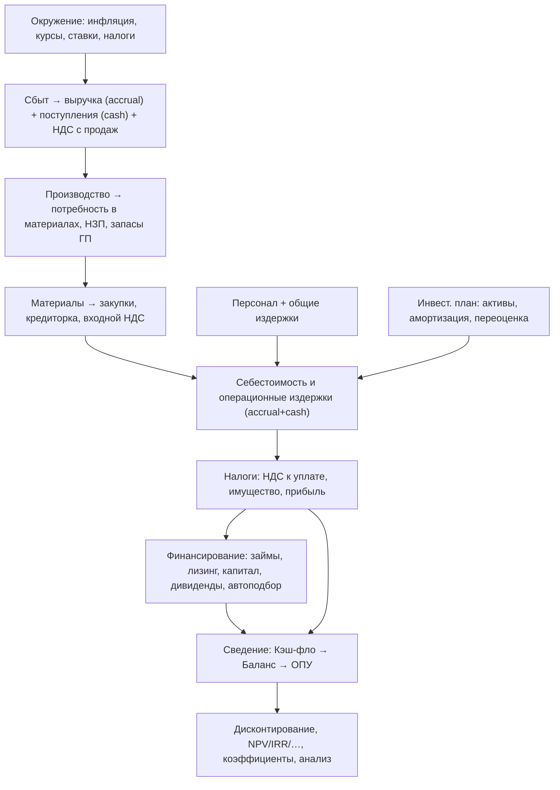

# Спецификация расчётного ядра (`calc_core`)

> **Назначение.** Точная спецификация методики расчёта трёх финансовых отчётов
> (Прибыли и убытки, Кэш-фло, Баланс), отчёта об использовании прибыли, показателей
> эффективности и финансовых коэффициентов, а также связей между разделами модели.
> Это самая ответственная часть проекта: от неё зависит **совпадение цифр** с
> оригиналом (Project Expert 7.21).
>
> **Основано на:** [`RESEARCH-ProjectExpert.md`](./RESEARCH-ProjectExpert.md),
> [`ARCHITECTURE-SaaS.md`](./ARCHITECTURE-SaaS.md). Построчная структура отчётов и
> формулы итоговых строк сверены с документацией оригинала (стандартная бухгалтерская
> терминология и общеотраслевая методика; проприетарный код/тексты не используются).
>
> **Статус:** Этап 3 — спецификация. Реализация — следующий этап.
> **Дата:** 2026-06-20

---

## Содержание
1. [Принципы и обозначения](#1-принципы-и-обозначения)
2. [Временная модель](#2-временная-модель)
3. [Денежная арифметика, валюты, инфляция](#3-денежная-арифметика-валюты-инфляция)
4. [Граф расчёта (порядок зависимостей)](#4-граф-расчёта-порядок-зависимостей)
5. [Подмодель: выручка, дебиторка, авансы, НДС с продаж](#5-подмодель-выручка-дебиторка-авансы-ндс-с-продаж)
6. [Подмодель: производство и запасы](#6-подмодель-производство-и-запасы)
7. [Подмодель: материалы, закупки, кредиторка, входной НДС](#7-подмодель-материалы-закупки-кредиторка-входной-ндс)
8. [Подмодель: персонал и общие издержки](#8-подмодель-персонал-и-общие-издержки)
9. [Подмодель: активы и амортизация](#9-подмодель-активы-и-амортизация)
10. [Подмодель: финансирование](#10-подмодель-финансирование)
11. [Налоговый движок (НДС, прибыль, имущество)](#11-налоговый-движок-ндс-прибыль-имущество)
12. [Отчёт о прибылях и убытках (I1–I28)](#12-отчёт-о-прибылях-и-убытках-i1i28)
13. [Кэш-фло (C1–C29)](#13-кэш-фло-c1c29)
14. [Баланс (B1–B34)](#14-баланс-b1b34)
15. [Отчёт об использовании прибыли (P1–P7)](#15-отчёт-об-использовании-прибыли-p1p7)
16. [Балансовые тождества и самопроверки](#16-балансовые-тождества-и-самопроверки)
17. [Дисконтирование и показатели эффективности](#17-дисконтирование-и-показатели-эффективности)
18. [Финансовые коэффициенты](#18-финансовые-коэффициенты)
19. [Автоподбор финансирования](#19-автоподбор-финансирования)
20. [Анализ: чувствительность, безубыточность, Монте-Карло, оценка бизнеса](#20-анализ-чувствительность-безубыточность-монте-карло-оценка-бизнеса)
21. [Стратегия тестирования и паритета](#21-стратегия-тестирования-и-паритета)
22. [Точки, требующие валидации по эталону](#22-точки-требующие-валидации-по-эталону)

---

## 1. Принципы и обозначения

- **Чистая детерминированная функция:** `calc_core.run(model, options) -> CalcResult`.
  Одинаковый вход + одинаковая `engine_version` ⇒ побитно одинаковый выход.
- **Двойной слой учёта:** все потоки рассчитываются параллельно по двум базам:
  - **начисление (accrual)** — для Отчёта о прибылях и убытках (без НДС);
  - **оплата (cash)** — для Кэш-фло (с НДС), с учётом графиков платежей.
  Разница между ними формирует **оборотный капитал** в Балансе (дебиторка, кредиторка,
  авансы, запасы, входной НДС).

**Обозначения строк отчётов** (используются как «адреса» при расчёте коэффициентов —
аналог нотации оригинала):

| Префикс | Отчёт |
|---|---|
| `I` | Отчёт о прибылях и убытках (Income statement), строки I1…I28 |
| `C` | Кэш-фло (Cash flow), строки C1…C29 |
| `B` | Баланс (Balance), строки B1…B34 |
| `P` | Отчёт об использовании прибыли (Profit use), строки P1…P7 |

Нижний индекс `t` — номер месяца (период). `Xn[t]` — значение строки `Xn` в периоде `t`.
Потоковые строки (I, C, P) — величины **за период**; балансовые (B) — **на конец периода**.

---

## 2. Временная модель

- Минимальный шаг расчёта — **1 месяц**. Внутренний расчёт **всегда помесячный**,
  независимо от шага отображения/дисконтирования.
- Ось времени: `t = 0 … N−1`, где `t=0` — месяц старта проекта (`header.start_date`),
  `N = header.duration_months`.
- **Агрегация для отображения** (месяц/квартал/полугодие/год): потоковые строки
  суммируются по периоду; балансовые берутся на конец периода; средние за период
  (для коэффициентов) — среднее балансовых.
- Этапы инвестиционного плана (календарный план) привязаны к датам и разворачиваются в
  помесячные потоки внутри `[t_start, t_end]` этапа.

---

## 3. Денежная арифметика, валюты, инфляция

### Точность
- Денежные суммы — **`Decimal`** с единым контекстом (по умолчанию `ROUND_HALF_UP`,
  рабочая точность ≥ 28 значащих цифр, округление результата к масштабу валюты при
  отображении). Никакого `float` в финансовых суммах.
- Промежуточные ряды хранятся в полной точности; округление — только на границах
  представления.

### Валюты
- Проект ведёт **две валюты** (основная и вторая). Курс `FX[t]` (`environment.fx_rate`,
  основной за единицу второй) — временной ряд; `fx_open` — курс на старте (t=−1).
- Каждая статья номинируется в своей валюте ввода; для сведения отчётов значения
  пересчитываются в валюту отчёта по `FX[t]`.
- **Прибыль/убыток от курсовой разницы** (I25) возникает из переоценки валютных
  остатков (денежные средства, займы, дебиторка/кредиторка в другой валюте) при
  изменении `FX[t]`. **Реализовано в 0.8.0** для опорной монетарной позиции
  `foreign_monetary`: `I25[t] = foreign_monetary · (FX[t] − FX[t−1])`, стоимость
  позиции в основной валюте → `B6`. Остальные валютные статьи — следующие шаги Фазы B.

### Инфляция
- Группы инфляции (сбыт, прямые издержки, недвижимость, зарплата, ОС) задаются рядами
  годовых ставок; преобразуются в месячные индексы:
  `infl_month = (1 + infl_year)^(1/12) − 1`.
- Цены/издержки соответствующих групп индексируются накопленным индексом
  `Idx_g[t] = Π_{k≤t}(1 + infl_g_month[k])`, если для статьи включена индексация.

---

## 4. Граф расчёта (порядок зависимостей)

> Финансовый контур (FIN) и налог на прибыль образуют **обратную связь** (проценты →
> прибыль → налог → потребность в деньгах → автоподбор кредита → проценты). Решается
> **итеративно** до сходимости (см. §19).

---

## 5. Подмодель: выручка, дебиторка, авансы, НДС с продаж

Для каждого продукта `p`:
- **Объём продаж** `Q_p[t]` (ряд) × **цена** `Pr_p[t]` (с индексацией/скачками) ⇒
  **начисленная выручка без НДС** `Rev_p[t] = Q_p[t] · Pr_p[t]`.
- **НДС с продаж (выходной)** `VATout_p[t] = Rev_p[t] · vat_rate_p` (частная ставка
  продукта имеет приоритет над общей).
- **Потери** (брак/невозврат) уменьшают чистую выручку (см. I2).
- **Налоги с продаж** (акциз, налог с продаж и т.п., не НДС) — I3.

### Условия оплаты → денежные поступления и оборотный капитал
Четыре схемы (+ общий параметр «задержка платежей» `delay_p`):
1. **По факту поставки** — деньги в периоде поставки + `delay`.
2. **Авансом** — деньги до поставки ⇒ формируется **Полученные авансы** (B24).
3. **В кредит** — деньги после поставки ⇒ формируется **Счета к получению** (B2).
4. **Сложная схема** — произвольное распределение долями по периодам.

Денежное поступление `CashSales[t] = Σ_p (Rev_p + VATout_p)`, распределённое по схеме
оплаты (**с НДС**). Тогда:
- `B2[t]` (дебиторка) = накопленная разница между начисленной выручкой с НДС и
  полученными деньгами по «кредитным» продажам;
- `B24[t]` (авансы) = накопленные авансы, ещё не закрытые поставкой.

> Связь со строками отчётов: начисление → I1; деньги (с НДС) → C1; разрывы → B2/B24.

---

## 6. Подмодель: производство и запасы

- **График производства** `Prod_p[t]` определяется планом производства (или
  «производство под продажи» с учётом страховых запасов).
- **Незавершённое производство (НЗП)** `B4[t]` — стоимость незаконченной продукции
  (длительный цикл производства распределяет затраты до выпуска).
- **Запасы готовой продукции** `B5[t]` = капитализированная стоимость производства
  (материалы + сдельная зарплата) минус признанная себестоимость продаж; растут при
  производстве впрок, падают при отгрузке. **Метод оценки** (`inventory_method`,
  реализовано в 0.7.6): **средняя** себестоимость (пул) либо **ФИФО** (по партиям
  выпуска). Оба сохраняют тождество `B5 = cum(стоимость) − cum(COGS)` → баланс сходится.
- **Себестоимость реализованной продукции** формирует прямые издержки в ОПУ (I5, I6).

> Запасы — буфер между производством (cash-затраты на материалы/труд) и продажами
> (выручка). Их динамика обеспечивает корректную стыковку accrual/cash. НЗП (B4) для
> длительного цикла — Фаза B (нужен ввод длительности производственного цикла).

---

## 7. Подмодель: материалы, закупки, кредиторка, входной НДС

Для каждого материала `m`:
- **Потребность** из норм расхода (BOM) производства: `Need_m[t] = Σ_p Prod_p[t]·norm_{p,m}`.
- **Закупки** `Buy_m[t]` с учётом страхового запаса и партий ⇒ **запас сырья** `B3[t]`.
- **Цена** с индексацией/скачками; **входной НДС** `VATin_m[t] = Cost_m[t]·vat_rate_m`.
- **Условия оплаты поставщикам** (аналогично §5) ⇒ **Счета к оплате** `B23[t]`
  (кредиторка) и денежные выплаты `C2[t]` (**с НДС**).
- **Входной НДС** до зачёта/оплаты накапливается в **Краткосрочных предоплаченных
  расходах** `B7[t]` (вместе с переплаченным НДС).

---

## 8. Подмодель: персонал и общие издержки

- **Персонал:** оклады по должностям/подразделениям, индексация по группе «зарплата»,
  привязка к периодам занятости. Разнос по функциям: административный (I13),
  производственный (I14), маркетинговый (I15) персонал. Сдельная зарплата — прямые
  издержки (I6).
- **Зарплатные налоги/взносы** — отдельные налоги в налоговом движке (база — ФОТ).
- **Общие издержки** (накладные) с разносом на: административные (I10), производственные
  (I11), маркетинговые (I12). Признак «выплачивать из прибыли» переносит издержку в
  I24 (не уменьшает налогооблагаемую базу — см. §11/§12).
- Денежные выплаты по персоналу и общим издержкам (с НДС, где применимо) → C6 и C5.

---

## 9. Подмодель: активы и амортизация

- **Капвложения (capex):** приобретение активов по календарному плану ⇒ выплаты `C14`
  (с входным НДС), рост ОС.
- **Основные средства** `B9` (первоначальная/восстановительная стоимость, gross);
  **накопленная амортизация** `B10`; **остаточная стоимость** `B11 = B9 − B10`.
- **Амортизация** `I17[t]` — по сроку службы/норме каждого актива (линейный метод по
  умолчанию; иные методы — расширяемо). Амортизация **не** является денежным потоком.
- **Переоценка** активов изменяет `B9` и добавочный капитал `B31`.
- **Продажа активов:** поступления `C16` (с НДС), списание остаточной стоимости,
  финансовый результат в «Другие доходы/издержки».
- **Налог на имущество** `I9` — база из остаточной стоимости (см. §11).
- Группировка в Балансе по остаточной стоимости: Земля `B12`, Здания `B13`,
  Оборудование `B14` (+ Предоплаченные расходы `B15`, Другие активы `B16`), их сумма =
  `B11`.

---

## 10. Подмодель: финансирование

- **Акционерный капитал** `C21`: поступления от выпусков (обыкновенные `B27`,
  привилегированные `B28`, сверх номинала `B29`).
- **Займы** `loan k`: поступления `C22` (рост `B22`/`B26` — кратко-/долгосрочные);
  **проценты** `Int_k[t]` (по ставке и схеме), **погашение тела** `C23`. Способ
  отнесения процентов:
  - **на себестоимость** (в пределах ставки рефинансирования) → I18;
  - **превышение над ставкой рефинансирования** или **полностью на прибыль** → I24.
- **Лизинг** `C25`: лизинговые платежи, имущество в лизинге `B19`, выкуп, страхование.
- **Инвестиции** (депозиты/ЦБ): вложения `C8`, доходы `C9`; в балансе — `B6`, `B18`.
- **Дивиденды** `C26` ← из отчёта об использовании прибыли (P4, P5).
- **Автоподбор** кредитов/инвестиций под дефицит/профицит наличности — §19.

---

## 11. Налоговый движок (НДС, прибыль, имущество)

Налоги настраиваемы (база, ставка, период, формула). Ключевые:

### НДС (VAT)
- **Кэш-фло — с НДС:** все поступления (C1) и выплаты (C2, C5, C14, …) включают НДС.
- **ОПУ — без НДС:** все строки I — нетто.
- **НДС к уплате в бюджет** входит в строку **Налоги** `C12`:
  `VAT_budget[t] = VATout_recognised[t] − VATin_recognised[t] − кредит`
  (момент признания задаёт `ProjectSettings.vat_basis`, реализовано в 0.7.2):
  - **«по отгрузке»** — исходящий НДС признаётся при отгрузке, входной — при закупке;
  - **«по оплате»** — исходящий по факту получения денег, входной по факту оплаты
    поставщику. Разрыв «начисление↔признание» паркуется в балансе: **отложенный
    исходящий НДС → `B21`** (отсроченные налоговые платежи), входной НДС вне зачёта и
    НДС с авансов выданных → `B7`. Это сохраняет балансовый инвариант.
- **Возврат/переплата НДС:** невозмещённый входной НДС копится в `B7` (НДС-кредит,
  переносится вперёд). Режим возврата переплаты в `C12` со знаком минус — к сверке (§22.2).

### Налог на прибыль (реализовано в 0.7.3)
- База — **налогооблагаемая прибыль** `I26` (см. §12), ставка `tax_profit`.
- **Перенос убытков** (`I22`): убыток периода (`I23 + I25 < 0`) накапливается в пуле и
  последовательно уменьшает базу будущих прибыльных периодов. В v0 — без ограничения
  доли (РФ: ≤50% базы) и срока действия; стартовый налоговый убыток не задаётся — к
  сверке (§22.7).
- **Льготы** (`ProjectSettings.profit_tax_benefit_share`, доля 0..1): часть
  налогооблагаемой прибыли освобождается от налога (вычитается из базы `I26`); на чистую
  прибыль `I28` влияет через меньший налог.
- `I27 = max(0, I26) · tax_profit`.

### Налог на имущество
- База — остаточная стоимость ОС (B11), ставка `tax_property`; результат → `I9`.

### Прочие налоги
- Налоги с продаж (I3), зарплатные взносы (в составе издержек), пользовательские
  налоги — через общий механизм «база × ставка» с возможной формулой (язык формул §7
  архитектуры).

---

## 12. Отчёт о прибылях и убытках (I1–I28)

База — **начисление**, суммы **без НДС**. Формулы итоговых строк:

| # | Строка | Формула |
|---|---|---|
| I1 | Валовый объём продаж | `Σ_p Rev_p` (начисленная выручка без НДС) |
| I2 | Потери | потери от невозврата/брака |
| I3 | Налоги с продаж | налоги с базой «продажи» (не НДС) |
| **I4** | **Чистый объём продаж** | **`I1 − I2 − I3`** |
| I5 | Материалы и комплектующие | прямые материальные затраты (себестоимость продаж) |
| I6 | Сдельная зарплата | прямой труд |
| **I7** | **Суммарные прямые издержки** | **`I5 + I6`** |
| **I8** | **Валовая прибыль** | **`I4 − I7`** |
| I9 | Налог на имущество | база B11 × ставка |
| I10 | Административные издержки | накладные (адм.) |
| I11 | Производственные издержки | накладные (произв.) |
| I12 | Маркетинговые издержки | накладные (маркет.) |
| I13 | Зарплата адм. персонала | ФОТ адм. |
| I14 | Зарплата произв. персонала | ФОТ произв. |
| I15 | Зарплата маркет. персонала | ФОТ маркет. |
| **I16** | **Суммарные постоянные издержки** | **`I10+I11+I12+I13+I14+I15`** |
| I17 | Амортизация | начисленная амортизация |
| I18 | Проценты по кредитам | проценты, отнесённые на себестоимость |
| **I19** | **Суммарные непроизводственные издержки** | **`I17 + I18`** |
| I20 | Другие доходы | прочие доходы |
| I21 | Другие издержки | прочие издержки |
| I22 | Убытки предыдущих периодов | перенос убытков |
| **I23** | **Прибыль до выплаты налога** | **`I8 − I9 − I16 − I19 + I20 − I21`** |
| I24 | Суммарные издержки, отнесённые на прибыль | проценты «на прибыль»/сверх ставки рефинансирования + общие издержки с опцией «из прибыли» (без НДС) |
| I25 | Прибыль от курсовой разницы | переоценка валютных статей |
| **I26** | **Налогооблагаемая прибыль** | **`I23 + I25 − I22 − льготы`** |
| I27 | Налог на прибыль | `max(0, I26) · tax_profit` |
| **I28** | **Чистая прибыль** | **`I23 + I25 − I24 − I27`** |

> **Проводка `I24` (реализовано в 0.7.1; SPEC §22.1).** «Издержки, отнесённые на прибыль»
> — **невычитаемые**: они **не входят** в `I23` (не уменьшают прибыль до налога) и **не
> входят** в налоговую базу `I26` (налог не уменьшается — в этом экономический смысл
> невычитаемости). При этом они **уменьшают чистую прибыль**
> `I28 = I23 + I25 − I24 − I27` (реальная издержка) и реально оплачиваются (деньги в
> Кэш-фло), поэтому баланс сходится. Источники `I24`: общие издержки с флагом «из прибыли»
> (`FixedCostLine.from_profit`) и проценты по займам с флагом «на прибыль»
> (`Loan.interest_on_profit`). С `I24 = 0` формулы тождественны прежним.
> Альтернатива (показывать `I24` как **использование** чистой прибыли в P-строках, а не
> внутри `I28`; а также частичный учёт «сверх ставки рефинансирования») — к сверке по
> эталону.

---

## 13. Кэш-фло (C1–C29)

База — **оплата**, суммы **с НДС**. Три вида деятельности + сальдо.

### Операционная деятельность
| # | Строка | Формула |
|---|---|---|
| C1 | Поступления от продаж | денежные поступления (с НДС) по схемам оплаты |
| C2 | Затраты на материалы и комплектующие | оплата поставщикам (с НДС) |
| C3 | Затраты на сдельную зарплату | выплаты сдельного труда |
| **C4** | **Суммарные прямые издержки** | **`C2 + C3`** |
| C5 | Общие издержки | оплата накладных (с НДС) |
| C6 | Затраты на персонал | выплаты ФОТ + взносы |
| **C7** | **Суммарные постоянные издержки** | **`C5 + C6`** |
| C8 | Вложения в краткосрочные ЦБ | покупка ЦБ |
| C9 | Доходы по краткосрочным ЦБ | доход от ЦБ |
| C10 | Другие поступления | прочие поступления |
| C11 | Другие выплаты | прочие выплаты |
| C12 | Налоги | НДС к уплате + налог на прибыль + имущество + прочие (возврат НДС со знаком −) |
| **C13** | **Кэш-фло от операционной деятельности** | **`C1 − C4 − C7 − C8 + C9 + C10 − C11 − C12`** |

### Инвестиционная деятельность
| # | Строка | Формула |
|---|---|---|
| C14 | Затраты на приобретение активов | capex (с НДС) |
| C15 | Другие издержки подготовительного периода | предынвестиционные затраты |
| C16 | Поступления от реализации активов | продажа ОС (с НДС) |
| C17 | Приобретение прав собственности (акций) | покупка долей |
| C18 | Продажа прав собственности | продажа долей |
| C19 | Доходы от инвестиционной деятельности | дивиденды/доходы от долей |
| **C20** | **Кэш-фло от инвестиционной деятельности** | **`C16 − C14 − C15 − C17 + C18 + C19`** |

### Финансовая деятельность
| # | Строка | Формула |
|---|---|---|
| C21 | Собственный (акционерный) капитал | поступления от выпуска акций |
| C22 | Займы | поступления по займам |
| C23 | Выплаты в погашение займов | погашение тела |
| C24 | Выплаты процентов по займам | проценты (вся сумма, кэш) |
| C25 | Лизинговые платежи | лизинг |
| C26 | Выплаты дивидендов | дивиденды (P4+P5) |
| **C27** | **Кэш-фло от финансовой деятельности** | **`C21 + C22 − C23 − C24 − C25 − C26`** |

### Сальдо
| # | Строка | Формула |
|---|---|---|
| C28 | Баланс наличности на начало периода | `C29[t−1]` (для t=0 — стартовые деньги) |
| **C29** | **Баланс наличности на конец периода** | **`C13 + C20 + C27 + C28`** |

---

## 14. Баланс (B1–B34)

На конец периода. Актив (B1–B20) = Пассив (B21–B34).

### Активы
| # | Строка | Формула / источник |
|---|---|---|
| B1 | Денежные средства | **`= C29`** (сальдо Кэш-фло) |
| B2 | Счета к получению | дебиторка (§5) |
| B3 | Сырьё, материалы и комплектующие | запас сырья (§7) |
| B4 | Незавершённое производство | НЗП (§6) |
| B5 | Запасы готовой продукции | запас ГП (§6) |
| B6 | Банковские вклады и ценные бумаги | краткосрочные вложения |
| B7 | Краткосрочные предоплаченные расходы | входной/переплаченный НДС + предоплаты |
| **B8** | **Суммарные текущие активы** | **`B1+B2+B3+B4+B5+B6+B7`** |
| B9 | Основные средства (первонач.) | gross ОС (справочно) |
| B10 | Накопленная амортизация | накопленная (справочно) |
| **B11** | **Остаточная стоимость ОС** | **`B12+B13+B14+B15+B16` (= B9 − B10)`** |
| B12 | Земля | остаточная |
| B13 | Здания и сооружения | остаточная |
| B14 | Оборудование | остаточная |
| B15 | Предоплаченные расходы | долгосрочные предоплаты |
| B16 | Другие активы | прочие внеоборотные |
| B17 | Инвестиции в основные фонды | незавершённые капвложения |
| B18 | Инвестиции в ценные бумаги | долгосрочные ЦБ |
| B19 | Имущество в лизинге | лизинговые активы |
| **B20** | **СУММАРНЫЙ АКТИВ** | **`B8 + B11 + B17 + B18 + B19`** |

### Пассивы
| # | Строка | Формула / источник |
|---|---|---|
| B21 | Отсроченные налоговые платежи | начисленные, но не уплаченные налоги |
| B22 | Краткосрочные займы | кратко-срочный долг |
| B23 | Счета к оплате | кредиторка + НДС «по оплате» |
| B24 | Полученные авансы | авансы покупателей |
| **B25** | **Суммарные краткосрочные обязательства** | **`B21+B22+B23+B24`** |
| B26 | Долгосрочные займы | долгосрочный долг |
| B27 | Обыкновенные акции | по номиналу |
| B28 | Привилегированные акции | по номиналу |
| B29 | Капитал, внесённый сверх номинала | эмиссионный доход |
| B30 | Резервные фонды | накопленные отчисления (P6) |
| B31 | Добавочный капитал | переоценка |
| B32 | Нераспределённая прибыль | **накопленная `Σ P7`** |
| **B33** | **Суммарный собственный капитал** | **`B27+B28+B29+B30+B31+B32`** |
| **B34** | **СУММАРНЫЙ ПАССИВ** | **`B25 + B26 + B33`** |

---

## 15. Отчёт об использовании прибыли (P1–P7)

| # | Строка | Формула |
|---|---|---|
| P1 | Чистая прибыль | `= I28` |
| P2 | Нераспределённая прибыль предыдущего периода | `P7[t−1]` |
| **P3** | **Прибыль к распределению** | **`P1 + P2`** |
| P4 | Дивиденды по привилегированным акциям | по дивидендной политике |
| P5 | Дивиденды по обыкновенным акциям | по дивидендной политике |
| P6 | Отчисления в резервы | по политике резервирования |
| **P7** | **Нераспределённая прибыль текущего периода** | **`P3 − P4 − P5 − P6`** |

> Связь: `B32[t] = P7[t]` (накопленная нераспределённая прибыль), `C26 = P4 + P5`,
> прирост `B30` за период `= P6`.

---

## 16. Балансовые тождества и самопроверки

Ядро обязано проверять (с допуском на округление `ε`):

1. **Баланс сходится:** `|B20[t] − B34[t]| ≤ ε` для всех `t`. Это главный инвариант.
2. **Деньги = сальдо Кэш-фло:** `B1[t] = C29[t]`.
3. **Нераспределённая прибыль:** `B32[t] = B32[t−1] + P7[t] − (дивиденды/резервы, учтённые в P)`.
4. **Амортизация:** `B10[t] = B10[t−1] + I17[t]` (без учёта выбытий); `B11 = B9 − B10`.
5. **Связь accrual/cash через оборотный капитал:** изменение `B2,B3,B4,B5,B23,B24`
   объясняет разницу между строками ОПУ и соответствующими строками Кэш-фло.

Любое нарушение инварианта №1 — фатальная ошибка модели (баг ядра), а не пользователя;
ловится тестами и runtime-ассертом.

---

## 17. Дисконтирование и показатели эффективности

Денежные потоки группируются в **инвестиции** `Inv[t]` (график потребности в капитале,
из дефицита наличности до финансирования) и **чистые поступления** `CF[t]`.

Месячная ставка: `r = (1 + R_year)^(1/12) − 1` (для каждой валюты своя `R`).

| Показатель | Формула |
|---|---|
| **NPV** | `Σ_{t} CF[t]/(1+r)^t − Σ_{t} Inv[t]/(1+r)^t` |
| **PI** | `Σ CF[t]/(1+r)^t ÷ Σ Inv[t]/(1+r)^t` |
| **IRR** | ставка `r*` (годовая), при которой `NPV = 0` (численно, метод бисекции/Ньютона) |
| **MIRR** | из наращения положительных потоков по ставке реинвестиций `R_reinv` и дисконтирования инвестиций по `r`: `MIRR = (FV_pos / PV_inv)^(1/n) − 1` |
| **PB** | минимальный период, когда кумулятивный недисконтированный `CF` покрывает инвестиции |
| **DPB** | то же по **дисконтированным** потокам |
| **ARR** | средний годовой доход ÷ средний объём инвестиций |

- Шаг дисконтирования (месяц/квартал/полугодие/год) влияет **только** на показатели
  эффективности, не на содержание отчётов.
- Показатели считаются для обеих валют проекта.

---

## 18. Финансовые коэффициенты

Считаются на каждый период (реализовано в 0.7.4). Конвенция по балансовым величинам:
**оборачиваемость** и **рентабельность активов/капитала** (ROA/ROE) используют **средние
за период** `(начало + конец)/2` (начало периода t=0 — стартовый баланс); **ликвидность**,
**структура капитала** и показатели **«на акцию»** — на **конец периода** (снимок).
Из ОПУ — итоговые за период; приведение к году — множитель ×12. `No` — число
обыкновенных акций. Формулы по стандартным определениям (нотация строк §1):

**Ликвидность**
- Текущая ликвидность `= B8 / B25`
- Срочная ликвидность `= (B1 + B2 + B6) / B25`
- Чистый оборотный капитал `= B8 − B25`

**Деловая активность** (период оборачиваемости, дней; «среднее» — среднее за период)
- Запасов `= 365 · avg(B3+B4+B5) / Себестоимость`
- Дебиторки `= 365 · avg(B2) / Выручка`
- Кредиторки `= 365 · avg(B23) / Закупки`
- Оборачиваемость рабочего капитала `= Выручка / avg(B8−B25)`
- Оборачиваемость ОС `= Выручка / avg(B11)`
- Оборачиваемость активов `= Выручка / avg(B20)`

**Структура капитала (Gearing)**
- Суммарные обязательства / активы `= (B25 + B26) / B20`
- Суммарные обязательства / собственный капитал `= (B25 + B26) / B33`
- Коэффициент покрытия процентов `= I23(до процентов) / I18`

**Рентабельность**
- Валовой прибыли `= I8 / I4`
- Операционной прибыли `= (I8 − I9 − I16) / I4`
- Чистой прибыли `= I28 / I4`
- ROA `= I28 / avg(B20)`
- ROE `= I28 / avg(B33)`

**Инвестиционные (на акцию, по итогам года)**
- EPS `= (I28 − дивиденды по привилег.) / No`
- Дивиденды на акцию `= P5 / No`
- Покрытие дивидендов `= I28 / (P4 + P5)`
- Активы на акцию `= B20 / No`

> Точные числители/знаменатели (какие именно строки в «среднем», поведение при делении
> на ноль, годовые множители) фиксируются тестами против эталона (§22).

---

## 19. Автоподбор финансирования

Финансовый контур замкнут (проценты ↔ прибыль ↔ налог ↔ деньги), поэтому решается
итеративно:

1. Рассчитать модель **без** автоподбора → получить `C29[t]` (сальдо наличности).
2. Если в каком-то `t` возникает **дефицит** (`C29[t] < минимального остатка`) —
   сгенерировать заём/привлечение по заданным правилам (тип, ставка, срок) на величину
   дефицита (с учётом будущих процентов).
3. Пересчитать модель (проценты изменили прибыль, налог, деньги).
4. Повторять до **сходимости** (изменения < `ε`) или лимита итераций.
5. Аналогично — **профицит**: размещение свободных средств (депозиты/ЦБ).

Свойства: детерминированность, ограничение числа итераций, защита от расходимости
(демпфирование шага), фиксация порядка генерации инструментов.

> **Реализовано в 0.7.5.** Кредитная линия (`solve_credit_line`) на каждом периоде
> вычитает из денег проценты на остаток долга и привлекает столько, чтобы остаток ≥
> минимального — так покрываются и накопленные проценты («сумма займа с учётом будущих
> процентов»). Внешняя итерация по налоговой обратной связи использует **адаптивное
> демпфирование**: шаг полный, но при невязке, переставшей убывать, уменьшается вдвое —
> это не меняет неподвижную точку, только защищает сходимость. Профицит/размещение
> свободных средств — следующая фаза.

---

## 20. Анализ: чувствительность, безубыточность, Монте-Карло, оценка бизнеса

- **Чувствительность:** для выбранного параметра варьируется значение в диапазоне;
  для каждого значения — полный пересчёт; на выходе — зависимость показателя (NPV, IRR…)
  от параметра.
- **Безубыточность:** точка, в которой выручка покрывает суммарные издержки; считается
  по продуктам/периодам (в натуральном и денежном выражении).
- **Монте-Карло:** заданным неопределённым параметрам присваиваются распределения;
  выполняется `N` итераций (со `seed`), на выходе — статистика показателей (среднее,
  σ, доверительные интервалы, вероятность `NPV>0` — «устойчивость проекта»).
  Тяжёлая операция → фоновые воркеры, векторизация (см. архитектуру §6, §9).
- **Оценка бизнеса:** 5 методов — ликвидационная стоимость, предполагаемая продажа,
  чистые активы, экспертная оценка, **модель Гордона** (`V = CF·(1+g)/(r−g)`); плюс
  **DDM** (дисконтирование дивидендов) и мультипликаторы.

---

## 21. Стратегия тестирования и паритета

1. **Юнит-тесты подмоделей** (выручка/дебиторка, амортизация, НДС, проценты…).
2. **Инвариант-тесты:** баланс сходится (§16) на случайно сгенерированных моделях
   (property-based).
3. **Golden master:** набор эталонных проектов с зафиксированными ожидаемыми числами;
   расхождение сверх `ε` — провал теста (аналог `clctst32.exe` в оригинале).
   - Эталоны строим из независимо проверенных ручных/Excel-расчётов и (по возможности)
     из выходов оригинала на тестовых проектах для верификации методики.
4. **Версионирование:** изменение методики ⇒ новая `engine_version`; старые эталоны
   замораживаются под старую версию.
5. **Сверка на образцах:** отраслевые примеры (АЗС, строительство, телеком и т.п.) как
   приёмочные сценарии.

---

## 22. Точки, требующие валидации по эталону

Места, где методика имеет нюансы и должна быть точно сверена с выходами оригинала перед
фиксацией `engine_version 1.0`:

1. **Проводка `I24`** («издержки, отнесённые на прибыль»): влияние на чистую прибыль
   `I28`, нераспределённую прибыль `B32` и наличность (см. примечание в §12).
   ✅ Реализовано в `0.7.1`: невычитаемые (вне `I26`), уменьшают `I28`, баланс сходится.
   Источники — `FixedCostLine.from_profit`, `Loan.interest_on_profit`. Открыто к сверке:
   подача через P-строки vs `I28`; частичный учёт «сверх ставки рефинансирования».
2. **Момент признания НДС** «по отгрузке» vs «по оплате» и его отражение в `B7`/`B23`,
   режим возврата переплаты в `C12`.
   ✅ Реализовано в `0.7.2` (`ProjectSettings.vat_basis`): «по оплате» признаёт НДС по
   факту денег; отложенный исходящий НДС → `B21`, входной вне зачёта → `B7`; баланс
   сходится. По умолчанию «по отгрузке» (тождественно прежнему). Открыто к сверке:
   НДС с авансов и режим возврата переплаты.
3. **Курсовая разница `I25`:** перечень переоцениваемых статей и знак.
   ✅ Механизм реализован в `0.8.0`: монетарная позиция во 2-й валюте (`foreign_monetary`)
   переоценивается по `fx_rate[t]` → `I25` (доход при росте курса), стоимость в `B6`;
   баланс сходится, курсовая разница входит в налоговую базу. Остальные валютные статьи
   (займы, выручка/издержки, дебиторка/кредиторка) и реализационный учёт налога на
   курсовую разницу — следующие шаги Фазы B (к сверке по эталону).
4. **График инвестиций `Inv[t]`** для показателей эффективности: точное правило
   выделения «прироста дефицита относительно максимума предыдущих периодов».
   ✅ Реализовано в `0.7.0` (`metrics.investment_graph`): `PI = 1 + NPV/PV_инв`,
   добавлены `pv_investments` и `peak_financing_need`. NPV не зависит от разбиения.
5. **Автоподбор:** правило расчёта суммы займа с учётом будущих процентов и порядок
   сходимости.
   ✅ Реализовано в `0.7.5`: привлечение покрывает накопленные проценты (`solve_credit_line`),
   внешняя итерация — с адаптивным демпфированием; проверено на высокой ставке (200%).
   Открыто к сверке: размещение профицита, точные правила генерации инструментов.
6. **Коэффициенты:** точные строки в числителях/знаменателях и годовые множители.
   ✅ Реализовано в `0.7.4`: оборачиваемость и ROA/ROE — на средние за период величины
   (начало t=0 = стартовый баланс); ликвидность/структура/«на акцию» — на конец периода.
   Открыто к сверке: какие именно строки усреднять, «закупки» для кредиторки (сейчас I5).
7. **Налог на прибыль:** учёт льгот и переноса убытков `I22` по периодам.
   ✅ Реализовано в `0.7.3`: последовательный пул убытков уменьшает базу будущих периодов;
   льгота `profit_tax_benefit_share` освобождает долю базы. Открыто к сверке: ограничение
   переноса (≤50% базы/срок), стартовый налоговый убыток.
8. **НЗП и запасы ГП:** правило оценки себестоимости (FIFO/средняя) и распределения
   затрат длительного цикла.
   ✅ Оценка ГП реализована в `0.7.6` (`inventory_method`: средняя/ФИФО). НЗП (B4) для
   длительного цикла — Фаза B (требует ввода длительности цикла производства).

> Эти пункты — приоритетный backlog для фазы реализации ядра (дорожная карта §19
> архитектуры, Фаза 1). До их валидации `engine_version` держим как `0.x`
> (предварительная).

---

*Документ описывает методику расчёта на основе стандартной финансовой методологии и
построчной структуры отчётов; проприетарный код и тексты Project Expert не используются.*
